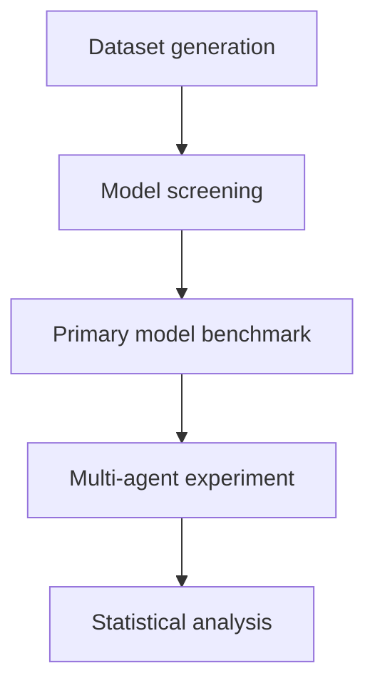
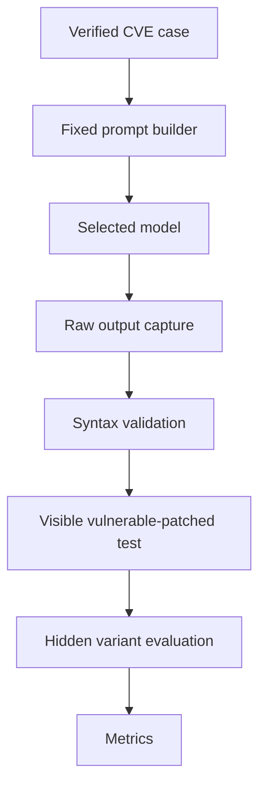
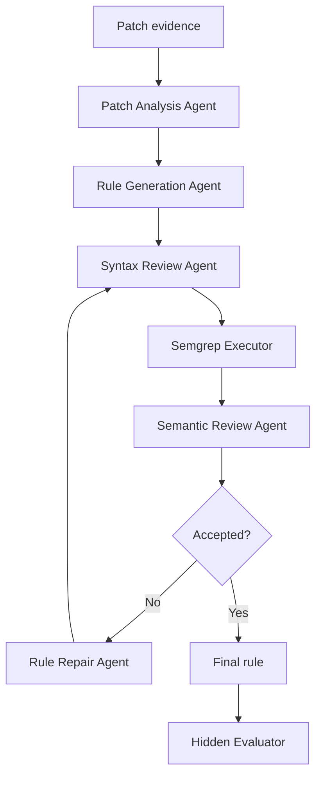

# Complete Experimental Design for LLM-Generated Semgrep Rules

## Benchmarking Semantic Fidelity, Generalization, and Multi-Agent Collaboration

**Study type:** Controlled empirical software-security benchmark  
**Target task:** Generate Semgrep rules from real vulnerability-fixing patches  
**Primary system:** Autogrep-based patch processing and rule validation  
**Primary models:** Open-weight code models  
**Extension:** Single-agent versus multi-agent rule generation  

---

## 1. Study purpose

This study evaluates whether open-weight large language models can convert real vulnerability-fixing patches into correct and reusable Semgrep rules. It also tests whether a multi-agent workflow improves rule quality beyond a single model receiving the same evidence and computational budget.

A generated rule is useful only when it:

1. Compiles and executes in Semgrep.
2. Detects the intended vulnerable code.
3. Does not report the patched code.
4. Detects unseen implementations of the same vulnerability mechanism.
5. Avoids reporting similar-looking safe code.

The experiment therefore evaluates executable behavior rather than judging rule text alone.

---

## 2. Main research objectives

1. Compare open-weight code models under identical patch-to-rule conditions.
2. Measure syntactic failure, semantic drift, patch discrimination, generalization, false positives, stability, and resource use.
3. Determine whether code-model family, size, security specialization, and agentic training affect performance.
4. Quantify how much Autogrep validation and retry stages contribute beyond raw model generation.
5. Determine whether agent-role separation improves results beyond iterative single-agent feedback.
6. Determine whether assigning different models to different agent roles provides further benefit.

---

## 3. Research questions

### RQ1: Syntactic validity

How frequently does each model generate a Semgrep rule that can be parsed, loaded, and executed?

### RQ2: Patch discrimination

How accurately does each generated rule detect the vulnerable revision while remaining silent on the patched revision?

### RQ3: Generalization

How well does each rule detect semantics-preserving variants of the source vulnerability?

### RQ4: Over-generalization

How frequently does each rule report patched, transformed-safe, or benign look-alike code?

### RQ5: Semantic drift

How much does each generated rule's executable behavior differ from the expected vulnerability semantics?

### RQ6: Model characteristics

How do model family, parameter scale, code specialization, security specialization, and architecture affect rule quality?

### RQ7: Pipeline contribution

How much do Autogrep retries, validation, and filtering change raw model performance?

### RQ8: Stability

How consistent are rule syntax and detection behavior across repeated generations?

### RQ9: Multi-agent contribution

Does a specialized multi-agent workflow outperform an equally resourced iterative single-agent workflow?

### RQ10: Heterogeneous collaboration

Does assigning different models to agent roles outperform using the same model in every role?

### RQ11: Efficiency

What are the accuracy, latency, token, memory, and energy tradeoffs of the evaluated models and workflows?

---

## 4. Experimental overview

The research contains four stages.



### Stage A: Dataset generation

Create verified vulnerable-patched pairs and hidden transformed test cases from CVE-linked fixing commits.

### Stage B: Model screening

Run all candidate models on a pilot dataset to verify compatibility and select the primary benchmark models.

### Stage C: Primary benchmark

Run the selected models under identical one-shot and Autogrep-assisted conditions on the held-out dataset.

### Stage D: Multi-agent experiment

Compare one-shot, iterative single-agent, homogeneous multi-agent, and limited heterogeneous multi-agent configurations.

---

## 5. Dataset sources

### 5.1 Primary source: MoreFixes

Use the **MoreFixes** dataset as the main source of CVE-linked vulnerability-fixing commits. It is directly relevant to patch-to-rule generation and is already used by Autogrep.

**Version pinned: v4** (record `20776007`, released 2026-06-20) — a deliberate choice over the earlier v2 (record `13983082`, referenced by Autogrep's own README) to get the larger, more current corpus MoreFixes' incremental collection process accumulates over time.

- [MoreFixes dataset on Zenodo (v4, pinned)](https://zenodo.org/records/20776007)
- [MoreFixes dataset on Zenodo (v2, superseded — Autogrep's own reference)](https://zenodo.org/records/13983082)
- [Autogrep repository](https://github.com/lambdasec/autogrep)

**Known open question (unresolved as of this writing, Zenodo was unreachable during verification):** v2 ships a ready-made `cvedataset-patches.zip` in the exact flat `.patch`-file format Autogrep's `patch_processor.py` already consumes. v4's file listing has not yet been confirmed — if it ships only a SQL dump (as its GitHub description suggests), a database-to-patch-file export step must be built before Autogrep's pipeline can consume it, which v2 would not have required. This must be confirmed and, if needed, built before Phase 2 curation can proceed. See `Research_Log/Implementation_Log.md`.

### 5.2 Verification and enrichment sources

Verify every selected case using:

- [GitHub Advisory Database](https://github.com/github/advisory-database)
- [National Vulnerability Database](https://nvd.nist.gov/)
- Original project repository and commit history
- Original maintainer security advisory
- [MITRE CWE](https://cwe.mitre.org/)

MoreFixes provides candidates. It must not be treated as automatically perfect ground truth. The original repository and security advisory provide the strongest evidence about what the fixing commit changed.

### 5.3 Source priority when records disagree

1. Original fixing commit and surrounding repository history
2. Original maintainer advisory
3. GitHub-reviewed advisory
4. NVD record
5. MoreFixes metadata

Record disagreements and the final decision.

---

## 6. Dataset size and partitioning

Prepare 380 verified CVE cases if resources permit:

| Partition | Cases | Purpose |
|---|---:|---|
| Pilot screening | 30 (expanded to 40, see 6.0.1) | Prompt development, model compatibility, initial selection |
| Multi-agent development | 50 | Role tests and C4 configuration selection |
| Final evaluation | 300 | Locked benchmark and final statistical analysis |
| **Total** | **380 (390 with the pilot expansion)** | |

If 380 verified cases are not feasible, use 330 cases:

- 30 pilot cases
- 300 final cases

In that reduced design, choose multi-agent configurations using only the 30-case pilot set. Never use the final 300 cases to select models, prompts, thresholds, or agent assignments.

### 6.0.1 Deliberate pilot expansion: 40 cases, JS and TS split (confirmed, final)

Section 6.1 treats JavaScript and TypeScript as one combined group for the 300-case final set. During pilot curation, candidates were verified separately per language (10 Python, 10 Java, 10 JavaScript, 10 TypeScript) rather than combining JS/TS into one 10-case group — a deliberate choice to get richer per-language signal during prompt development and model screening, since JS and TS differ syntactically in ways relevant to Semgrep pattern-writing (type annotations, interfaces, generics). This makes the pilot **40 cases, not 30**.

**This is confirmed as the final structure — not revisited for the final set.** The pilot and the 300-case final set serve different purposes (Section 29: pilot = model/prompt development, final = locked benchmark) and are not required to mirror each other structurally. The final set keeps JS/TypeScript combined at 100 cases as Section 6.1 already specifies; any JS-vs-TS difference worth reporting there can be handled as a subgroup breakdown within that 100 (consistent with Section 19's existing per-language subgroup reporting), without doubling the final-set curation and benchmark-execution cost that a full 100/100 split would require.

### 6.1 Target language distribution for the final set

| Language | Target CVEs |
|---|---:|
| Python | 100 |
| Java | 100 |
| JavaScript/TypeScript | 100 |
| **Total** | **300** |

If the source data cannot provide 100 valid cases for a language, preserve all verified cases and report macro-averaged results so the largest language does not dominate.

### 6.2 Vulnerability coverage

Attempt to include:

- SQL, command, code, and template injection
- Cross-site scripting
- Path traversal and unsafe file operations
- Unsafe deserialization
- XML external entity processing
- Server-side request forgery
- Authentication problems
- Authorization and access-control problems
- Weak cryptography
- Information exposure
- Input-validation failures

Report the exact CWE distribution. Do not force equal numbers when valid cases are unavailable.

---

## 7. Inclusion and exclusion criteria

### 7.1 Inclusion criteria

Include a case only if:

- It has a public CVE or GHSA identifier.
- The original repository is accessible.
- The fixing commit is identifiable.
- The parent commit contains the vulnerable behavior.
- The fixed commit contains the relevant correction.
- The advisory and patch describe the same vulnerability.
- The relevant source language is supported by Semgrep.
- The affected file parses successfully.
- The vulnerability-relevant location can be identified.
- The vulnerability is fully or partially representable with Semgrep.
- The source license permits the planned research processing and artifact release.

Prefer one-file security fixes in the primary benchmark. Multi-file fixes may be retained as a separately reported difficulty group if Autogrep and the evaluation pipeline handle them consistently.

### 7.2 Exclusion criteria

Exclude:

- Documentation-only commits
- Dependency-version-only changes
- Binary patches
- Reverts without a confirmed final fix
- Deleted or inaccessible commits
- Formatting-only changes
- Large mixed-purpose commits where the security change cannot be isolated
- Unsupported languages
- Cases without an identifiable vulnerable location
- Duplicated CVEs, commits, or near-identical patches
- Vulnerabilities requiring runtime state that the configured Semgrep engine cannot observe

### 7.3 Representability labels

Label each candidate:

- **Supported:** Semgrep can reasonably express the vulnerability mechanism.
- **Partially supported:** Semgrep can observe part of the mechanism, but important context is unavailable.
- **Unsupported:** Semgrep cannot reasonably express the vulnerability.

Use supported cases for the main ranking. Analyze partially supported cases separately. Exclude unsupported cases from comparative performance metrics while reporting their number.

---

## 8. Dataset-generation procedure

### Step 1: Import and filter MoreFixes

Filter candidates by language, accessible repository, patch availability, and source-file type.

### Step 2: Deduplicate

Deduplicate using:

- CVE and GHSA identifiers
- Repository and commit hash
- Normalized patch hash
- Near-duplicate changed code
- Multiple records referring to the same fix

### Step 3: Retrieve exact repository states

For every candidate:

1. Fetch the repository.
2. Check out the fixing commit.
3. Resolve the correct vulnerable parent.
4. Save immutable commit hashes.
5. Extract relevant files from both revisions.
6. Save the unified diff.

Do not depend on branch names because branches may move.

### Step 4: Verify security relevance

Confirm that:

- The changed code corresponds to the advisory.
- The parent contains the vulnerable behavior.
- The child contains the intended fix.
- The changed region is not merely refactoring.
- The security-relevant file, function, and lines can be recorded.

### Step 5: Extract fixed model context

Extract the same categories of context for every model:

- Vulnerable function or method
- Patched function or method
- Relevant imports
- Containing class when required
- Unified diff
- CVE identifier
- CWE identifier and short definition

Define a shared maximum context limit. Truncate using one deterministic policy.

### Step 6: Classify difficulty

Record:

- Language
- CWE
- Changed lines
- Changed files
- Function size
- Pattern or taint requirement
- Structural or context-heavy category
- Supported or partially supported status

### Step 7: Freeze the manifest

Assign stable case IDs, hash every artifact, and freeze the pilot, development, and final partitions before model execution.

---

## 9. Ground-truth test bundle

Create at least six samples per CVE:

| Sample | Label | Purpose |
|---|---|---|
| Original vulnerable code | Positive | Source vulnerability detection |
| Original patched code | Negative | Fix discrimination |
| Renamed vulnerable variant | Positive | Identifier independence |
| Structurally changed vulnerable variant | Positive | Generalization |
| Transformed safe variant | Negative | Safe-code rejection |
| Benign structural look-alike | Negative | Over-generalization |

For 300 CVEs:

\[
300 \times 6 = 1,800 \text{ labelled samples}
\]

### 9.1 Permitted transformations

- Variable renaming
- Function or method renaming
- Equivalent literal substitution
- Introduction of intermediate variables
- Equivalent conditional rewriting
- Equivalent API-call formatting
- Wrapper-function introduction
- Safe statement reordering
- Alternate but equivalent data-flow expression

### 9.2 Transformation validation

Every transformed sample must:

- Parse successfully.
- Preserve its vulnerable or safe label.
- Avoid introducing another vulnerability.
- Preserve the original language and relevant framework assumptions.
- Be recorded in a transformation manifest.
- Pass build or unit checks when practical.

Do not allow an evaluated model to certify its own test variants. Prefer deterministic transformation templates and executable checks.

### 9.3 Finding-location correctness

A finding counts as a true positive only when it:

- Appears in the expected file, and
- Overlaps the labelled vulnerable region or a verified source/sink location, and
- Represents the intended vulnerability mechanism.

A report elsewhere in the file does not automatically count as detection of the target CVE.

---

## 10. Dataset schema

Store metadata as JSONL.

```json
{
  "case_id": "CASE-0001",
  "cve_id": "CVE-XXXX-XXXX",
  "ghsa_id": "GHSA-XXXX-XXXX-XXXX",
  "cwe_ids": ["CWE-89"],
  "language": "python",
  "repository": "owner/project",
  "vulnerable_commit": "parent-hash",
  "fixed_commit": "fix-hash",
  "changed_file": "src/database.py",
  "changed_function": "execute_query",
  "vulnerable_lines": [40, 45],
  "context_complexity": "structural",
  "semgrep_representability": "supported",
  "patch_size_added": 4,
  "patch_size_deleted": 3,
  "advisory_date": "YYYY-MM-DD",
  "repository_license": "...",
  "split": "final",
  "source_urls": [],
  "artifact_hashes": {}
}
```

Recommended structure:

```text
benchmark/
├── manifest.jsonl
├── inclusion_log.csv
├── exclusion_log.csv
├── cases/
│   └── CASE-0001/
│       ├── metadata.json
│       ├── patch.diff
│       ├── vulnerable_source.py
│       ├── patched_source.py
│       ├── variant_vulnerable_01.py
│       ├── variant_vulnerable_02.py
│       ├── variant_safe_01.py
│       └── benign_lookalike.py
└── schemas/
```

---

## 11. Candidate model set

The available candidates are organized by experimental purpose.

### 11.1 Primary code-model candidates

| Model | Approximate scale | Research value |
|---|---:|---|
| `qwen2.5-coder:7b-instruct` | 7B | Modern small code-model baseline |
| `codellama:7b-instruct-fp16` | 7B | Older established code-model comparison |
| `deepseek-coder:6.7b` | 6.7B | Independent small code family |
| `codegemma:7b` | 7B | Independent Google code family |
| `yi-coder:9b` | 9B | Independent small-medium code family |
| `magicoder:7b` | 7B | Instruction-tuned code model from an independent training recipe |
| `qwen2.5-coder:32b` | 32B | Same-family scale comparison |
| `DeepHat/DeepHat-V1-7B` | 7B | Cybersecurity-focused Qwen Coder fine-tune |

DeepHat is particularly useful because it supports a controlled comparison with Qwen2.5-Coder-7B, its underlying code-model family.

Magicoder is included as an instruction-tuned code-model candidate. Before execution, record the exact Magicoder variant behind the local tag, such as Magicoder-CL-7B or Magicoder-DS-6.7B, because `magicoder:7b` alone is not sufficient provenance.

### 11.2 Optional generational comparison

| Model | Treatment |
|---|---|
| `codeqwen:7b` | Optional pilot candidate; empirically confirmed instruct-tuned via direct instruction-following probe on GPU-farmi-004 (2026-09) — base-model lineage (CodeQwen1.5-7B-Chat) still worth citing in the model card, but functional instruct status is settled |

CodeQwen is useful for a within-family historical comparison against Qwen2.5-Coder-7B-Instruct. It should not replace an independent-family model in the core benchmark. If resources permit, screen it as a thirteenth candidate and retain it only for a clearly labeled Qwen-generation analysis.

### 11.3 Advanced code models

| Model | Treatment |
|---|---|
| `qwen3-coder-next` | Separate large sparse/agentic code-model group |
| `qwen2.5-coder-swe` | Include only after provenance, license, base model, and exact weights are verified |

Qwen3-Coder-Next has approximately 80B total parameters and 3B active parameters per token. Do not compare its total parameter count directly with a dense 7B model. Record total parameters, active parameters, memory, and quantization separately.

### 11.4 Reasoning-model baselines

| Model | Treatment |
|---|---|
| `QwQ-32B-GGUF` | Secondary reasoning baseline and possible agent-role candidate |
| `deepseek-r1:14b` | Secondary reasoning baseline and possible analysis/review agent |

These are not dedicated code models. If included in direct generation, label them as reasoning baselines rather than merging them silently into the code-model group.

### 11.5 Tag verification status

None of the GPT-Lab catalog tags for `deepseek-coder:6.7b`, `codegemma:7b`, `yi-coder:9b`, or `qwen2.5-coder:32b` carry an explicit `-instruct`/`-it`/`-chat` suffix — those suffixed tag names do not exist on this infrastructure. Instruct-tuning status for all primary candidates was instead confirmed empirically, by sending each model a strict-format instruction probe and a direct Q&A probe and checking whether it followed the instruction versus behaved as a raw completion model:

- `qwen2.5-coder:7b-instruct` (farmi-001) — confirmed instruct
- `qwen2.5-coder:32b` (farmi-004) — confirmed instruct
- `codellama:7b-instruct-fp16` (farmi-003) — confirmed instruct
- `deepseek-coder:6.7b` (farmi-004) — confirmed instruct
- `codegemma:7b` (farmi-004) — confirmed instruct
- `yi-coder:9b` (farmi-004) — confirmed instruct
- `magicoder:7b` (farmi-001) — confirmed instruct; exact base checkpoint (Magicoder-CL-7B vs. Magicoder-DS-6.7B) still needs to be resolved and recorded before the final study
- `codeqwen:7b` (farmi-004) — confirmed instruct
- `DeepHat/DeepHat-V1-7B` (farmi-004) — confirmed instruct
- `starcoder2:15b` (farmi-004) — **failed** both probes (ignored the format instruction, echoed the prompt back as raw text); confirmed base-only, no instruct-tuned StarCoder2 tag exists in this catalog, hence its removal from Section 11.1

Never rely on `latest` in the final study. Record the exact Ollama digest or model-file hash for every tag above before Phase 1.

### 11.6 Precision control

Do not compare `codellama:7b-instruct-fp16` against mostly 4-bit models as if only architecture differed.

Choose one primary precision policy:

1. All models in BF16/FP16, or
2. All models using the same quantization class, such as Q4_K_M where available.

If both CodeLlama FP16 and Q4 are tested, report this as a quantization ablation.

---

## 12. Model screening and final selection

### 12.1 Pilot screening

Run all 12 core candidates on the 30-case pilot set. If CodeQwen is available as CodeQwen1.5-7B-Chat, screen it as an optional thirteenth candidate.

Measure:

- Output-format compliance
- Raw Syntactic Compilation Rate
- Patch Discrimination Score
- MCC
- Vulnerability Generalization Recall
- False-Positive Rate
- End-to-End Successful Rule Rate
- Median latency
- Peak memory
- Failure rate

### 12.2 Primary benchmark selection

Select six to eight models using criteria declared before screening:

- Best small code model
- Best medium code model
- Best large code model
- Best independent family representatives
- Best cybersecurity-specialized model
- Best efficiency result
- Best overall semantic result

The recommended initial primary set is the eight code-focused models in Section 11.1. If compute is limited, select six without removing the controlled Qwen 7B versus 32B and Qwen 7B versus DeepHat comparisons.

### 12.3 Secondary reporting

Report Qwen3-Coder-Next, Qwen2.5-Coder-SWE, QwQ, and DeepSeek-R1 separately unless pilot evidence and precision controls justify their inclusion in the main ranking.

---

## 13. Prompt and inference controls

### 13.1 Fixed prompt inputs

Every direct-generation model receives the same information:

- Language
- CVE and CWE metadata
- Vulnerable code
- Patched code
- Unified diff
- Semgrep output requirements

### 13.2 Prompt template

```text
Generate one Semgrep rule from the verified vulnerability-fixing evidence.

Language: {{language}}
CVE: {{cve_id}}
CWE: {{cwe_id}} - {{cwe_description}}

Vulnerable code:
{{vulnerable_code}}

Patched code:
{{patched_code}}

Patch:
{{patch}}

The rule must detect the vulnerable behavior and avoid matching the patched
behavior. Generalize the security mechanism without depending on unnecessary
repository-specific names.

Return exactly one Semgrep YAML rule. Do not include Markdown fences or prose.
Include id, languages, message, severity, metadata, and the required pattern
or taint-mode fields.
```

Develop the prompt using only pilot cases. Hash and freeze it before final evaluation.

### 13.3 Primary deterministic configuration

```yaml
temperature: 0
sampling: false
max_output_tokens: 2048
outputs_per_case: 1
raw_retries: 0
context_limit: fixed_common_limit
```

### 13.4 Stability configuration

Use a stratified 100-CVE subset:

```yaml
temperature: 0.2
runs_per_model_case: 5
sampling_parameters: fixed
```

### 13.5 Environment recording

Record:

- Exact model name and revision
- Ollama digest or weight hash
- Base versus instruction-tuned status
- License
- Precision and quantization
- Context window
- Prompt template
- Temperature, top-p, top-k, and seed
- Runtime version
- GPU, CPU, RAM, and operating system
- Autogrep commit
- Semgrep version
- Execution date

---

## 14. Direct rule-generation pipeline



For every case and model:

1. Render the frozen prompt.
2. Generate one raw response.
3. Save the exact response before extraction or repair.
4. Parse YAML.
5. Validate required fields.
6. Load the rule with pinned Semgrep.
7. Execute it on the original vulnerable and patched samples.
8. Execute it on hidden transformed vulnerable and safe samples.
9. Calculate metrics.

All requested generations remain in end-to-end denominators, including empty, malformed, and invalid outputs.

---

## 15. Autogrep condition

Use Autogrep as the common practical pipeline, not as the only judge of correctness.

Compare:

- **Raw condition:** First model output, no retry or correction
- **Autogrep condition:** Final output after fixed retry, validation, and filtering stages

Recommended Autogrep configuration:

```yaml
max_retries: 3
max_files_changed: 1
semgrep_version: pinned
autogrep_commit: pinned
validation_policy: fixed
filtering_policy: fixed
embedding_model: fixed
```

Save every attempted rule, validation result, retry reason, filtering decision, and final output.

The independent hidden evaluator must test both raw and final rules. Autogrep's original vulnerable/fixed validation alone is insufficient to establish generalization or a low false-positive rate.

---

## 16. Correctness evaluation

### 16.1 Correctness levels

| Level | Definition |
|---|---|
| 0: Invalid | Does not compile or execute |
| 1: Executable | Compiles but misses the original vulnerability |
| 2: Source-specific | Detects vulnerable and rejects patched source pair |
| 3: Generalizable | Also detects hidden vulnerable variants |
| 4: Reliable | Generalizes while maintaining low false positives |

### 16.2 End-to-end correctness rule

Predefine a successful generated rule as one that:

1. Compiles and executes.
2. Detects the original vulnerable sample at the expected location.
3. Does not report the original patched sample.
4. Achieves Vulnerability Generalization Recall of at least 0.80.
5. Achieves False-Positive Rate of at most 0.10.

Run threshold sensitivity analysis at:

- VGR: 0.60, 0.80, and 1.00
- FPR: 0.00, 0.10, and 0.20

This prevents the conclusion from depending on one arbitrary threshold.

---

## 17. Multi-agent experimental design

### 17.1 Agent workflow



Semgrep execution and hidden evaluation are deterministic components, not LLM agents.

### 17.2 Agent roles

#### Patch Analysis Agent

- Explain the vulnerability mechanism.
- Identify sources, sinks, sanitizers, and missing checks.
- Distinguish essential APIs from project-specific names.
- Recommend pattern or taint mode.
- Return a structured vulnerability specification.

#### Rule Generation Agent

- Convert the specification into one Semgrep YAML rule.
- Avoid unnecessary repository-specific matching.
- Save the first generated rule before review.

#### Syntax Review Agent

- Diagnose YAML and Semgrep DSL problems.
- Apply or recommend the smallest syntax correction.
- Avoid changing rule meaning without an explicit warning.

#### Semantic Review Agent

- Compare the rule with patch evidence and execution results.
- Diagnose misses, patched-code findings, over-generalization, and under-generalization.
- Produce structured repair instructions.

#### Rule Repair Agent

- Revise the rule using deterministic diagnostics and review output.
- Preserve correct rule components.
- Stop after three repair rounds.

### 17.3 Hidden-evaluation protection

| Evidence | Visible to agents? |
|---|---:|
| Original patch | Yes |
| Original vulnerable code | Yes |
| Original patched code | Yes |
| Semgrep compiler and visible execution results | Yes |
| Transformed vulnerable variants | No |
| Transformed safe variants | No |
| Benign look-alikes | No |

Agents must never repair rules against final hidden variants.

---

## 18. Multi-agent configurations

| ID | Configuration | Main purpose |
|---|---|---|
| C1 | One-shot single agent | Direct generation baseline |
| C2 | Iterative single agent | Effect of feedback and additional attempts |
| C3-S | Homogeneous multi-agent using strongest model | Effect of role separation |
| C3-E | Homogeneous multi-agent using efficient model | Cost-conscious role separation |
| C4-A | Best pilot model assigned to each role | Model specialization |
| C4-B | Strong generator with efficient reviewers | Accuracy-cost balance |

### 18.1 C1: One-shot baseline

One model receives the patch and produces one rule without feedback.

### 18.2 C2: Iterative single agent

The same model generates, interprets Semgrep feedback, and repairs its rule. Give it the same call and token budget as C3.

### 18.3 C3: Homogeneous multi-agent

The same underlying model performs all LLM roles with separate role prompts and contexts. Compare C3-S directly with C2 using the same model and budget.

### 18.4 C4-A: Best model per role

Select the best pilot-performing model for each role according to predefined role metrics.

### 18.5 C4-B: Cost-efficient heterogeneous team

Use a strong model for analysis, generation, and repair and a smaller model for syntax and semantic review.

### 18.6 Why C4 is limited

With 12 core candidate models and five roles, unrestricted assignment produces:

\[
12^5 = 248,832 \text{ possible assignments}
\]

If optional CodeQwen is included, the space becomes:

\[
13^5 = 371,293 \text{ possible assignments}
\]

Do not search this space on the final benchmark. Select at most two heterogeneous configurations from pilot or development evidence and freeze them before final evaluation.

---

## 19. Role-capability screening

Direct rule-generation performance does not prove that a model is the best reviewer or analyzer. Test role-specific performance on pilot or development data.

| Role | Expected output | Selection measurement |
|---|---|---|
| Patch analysis | Structured vulnerability specification | Mechanism, source, sink, and fix accuracy |
| Rule generation | Semgrep YAML | ESR, MCC, and PDS |
| Syntax review | Diagnosis or corrected rule | Error-diagnosis and compilation-recovery rate |
| Semantic review | Failure classification | Correct failure diagnosis |
| Rule repair | Revised executable rule | Repair success and regression rate |

Preliminary candidates may include:

| Role | Candidate models |
|---|---|
| Patch analysis | DeepSeek-R1 14B, QwQ-32B, Qwen3-Coder-Next |
| Rule generation | Qwen2.5-Coder 32B, DeepHat, Qwen3-Coder-Next |
| Syntax review | Qwen2.5-Coder 7B, Magicoder 7B |
| Semantic review | DeepSeek-R1 14B, QwQ-32B, DeepHat |
| Rule repair | Qwen2.5-Coder 32B, DeepHat, Qwen3-Coder-Next |

These are hypotheses. Final assignments must follow measured pilot performance.

---

## 20. Fair-budget controls

The main causal multi-agent comparison is C2 versus C3 using the same model and budget.

Recommended per-CVE limits:

```yaml
max_llm_calls: 6
max_combined_input_tokens: 30000
max_combined_output_tokens: 6000
max_repair_rounds: 3
max_wall_clock_minutes: 10
```

Also keep constant:

- Patch and code evidence
- Prompt information content
- Semgrep version
- Autogrep version
- Visible execution feedback
- Hidden evaluation corpus
- Success thresholds
- Hardware allocation where practical

Run an unrestricted practical comparison only as a secondary analysis.

---

## 21. Evaluation metrics

Standard classification measures may be implemented using [scikit-learn metrics](https://scikit-learn.org/stable/api/sklearn.metrics.html).

### 21.1 Confusion matrix

- **TP:** Vulnerable sample detected at an accepted target location
- **FN:** Vulnerable sample missed
- **FP:** Patched or benign sample incorrectly reported
- **TN:** Patched or benign sample correctly ignored

### 21.2 Raw Syntactic Compilation Rate

\[
SCR_{raw} = \frac{\text{raw executable rules}}{\text{all requested generations}}
\]

### 21.3 Precision

\[
Precision = \frac{TP}{TP+FP}
\]

### 21.4 Recall

\[
Recall = \frac{TP}{TP+FN}
\]

### 21.5 F1-score

\[
F1 = \frac{2 \times Precision \times Recall}{Precision+Recall}
\]

### 21.6 False-Positive Rate

\[
FPR = \frac{FP}{FP+TN}
\]

### 21.7 Specificity

\[
Specificity = \frac{TN}{TN+FP}
\]

### 21.8 Balanced Accuracy

\[
Balanced\ Accuracy = \frac{Recall+Specificity}{2}
\]

### 21.9 Matthews Correlation Coefficient

\[
MCC = \frac{TP \times TN-FP \times FN}
{\sqrt{(TP+FP)(TP+FN)(TN+FP)(TN+FN)}}
\]

Use MCC as the main overall sample-level semantic classification metric.

### 21.10 Patch Discrimination Score

\[
PDS = \frac{\text{rules detecting vulnerable but not patched source}}{\text{all requested cases}}
\]

### 21.11 Vulnerability Generalization Recall

\[
VGR = \frac{\text{hidden vulnerable variants detected}}{\text{all hidden vulnerable variants}}
\]

### 21.12 Balanced Semantic Drift Rate

\[
BSDR = 1-Balanced\ Accuracy = \frac{FNR+FPR}{2}
\]

Lower is better. BSDR is a study-specific operational measure, so always report FNR and FPR with it.

### 21.13 End-to-End Successful Rule Rate

\[
ESR = \frac{\text{rules meeting every predefined correctness condition}}{\text{all requested rules}}
\]

### 21.14 Repair Success Rate

\[
Repair\ Success = \frac{\text{initial failures recovered}}{\text{initial failed rules}}
\]

### 21.15 Regression Rate

\[
Regression = \frac{\text{initial successes damaged by later processing}}{\text{initial successful rules}}
\]

### 21.16 Collaboration Gain

\[
Collaboration\ Gain_{ESR}=ESR_{C3}-ESR_{C2}
\]

Calculate equivalent differences for MCC, PDS, VGR, FPR, latency, tokens, and energy.

### 21.17 Efficiency metrics

Report separately:

- Input and output tokens
- Generation time
- Validation time
- End-to-end time
- Peak GPU and system memory
- GPU energy, if reliable measurement is available
- Successful rules per GPU-hour
- Successes per million tokens
- Successful rules per model call

Do not hide these quantities inside one unexplained cost score.

---

## 22. Statistical analysis

Every model or workflow processes the same cases, so use paired analysis.

### 22.1 Descriptive reporting

- Count
- Mean and median
- Standard deviation
- Interquartile range
- Minimum and maximum
- 95% bootstrap confidence intervals

### 22.2 Tests

- Friedman test for overall comparison of multiple models or configurations
- McNemar's test for paired binary success outcomes
- Wilcoxon signed-rank test for paired MCC, latency, token, and cost outcomes
- Holm correction for multiple pairwise tests

Report effect sizes and confidence intervals with p-values.

### 22.3 Main comparisons

Predefine:

1. Qwen2.5-Coder 7B versus 32B: scale effect
2. Qwen2.5-Coder 7B versus DeepHat 7B: security fine-tuning effect
3. Small code-model families: family effect at similar scale
4. Raw versus Autogrep output: pipeline effect
5. C1 versus C2: iterative feedback effect
6. C2 versus C3: role-separation effect
7. C3 versus C4: heterogeneous assignment effect

### 22.4 Subgroup analysis

Report by:

- Language
- CWE
- Structural versus context-heavy cases
- Pattern versus taint rules
- Patch size
- Supported versus partially supported cases
- Older versus newer CVEs

Use repository-aware confidence intervals or mixed-effects analysis because CVEs from the same repository are not fully independent.

---

## 23. Contamination controls

Public CVEs and public Semgrep rules may appear in model training data.

Use:

- CVE and fix publication dates
- Model cutoff information when available
- Older versus newer CVE reporting
- Exact and near-duplicate search against public Semgrep rules
- Detection of copied rule IDs, messages, and uncommon identifiers
- Repository-grouped analysis
- Hidden transformed variants
- Patch deduplication

Do not claim complete contamination removal. Present remaining contamination risk as a validity threat.

---

## 24. Failure taxonomy

### Generation failures

- Empty output
- Timeout
- Truncation
- Non-YAML response
- Multiple rules
- Out-of-memory failure

### Syntax failures

- Invalid YAML
- Missing required fields
- Invalid language
- Invalid metavariable
- Unsupported operator
- Invalid taint configuration
- Semgrep runtime error

### Semantic failures

- Original vulnerability missed
- Patched source reported
- Wrong vulnerability mechanism
- Source-sink relationship lost
- Sanitizer ignored
- Vulnerable and fixed meanings reversed
- Repository-specific matching
- Under-generalization
- Over-generalization

### Multi-agent failures

- Incorrect analysis propagated to later agents
- Reviewer introduces unjustified changes
- Repair oscillation
- Correct rule damaged by repair
- Token or call budget exhausted
- Hidden-test leakage
- Agent schema failure
- Incompatible assumptions between models

---

## 25. Result tables

### 25.1 Primary model table

| Model | SCR | PDS | Precision | Recall | F1 | MCC | VGR | FPR | BSDR | ESR | Time | Memory |
|---|---:|---:|---:|---:|---:|---:|---:|---:|---:|---:|---:|---:|
| Qwen2.5-Coder 7B | | | | | | | | | | | | |
| CodeLlama 7B | | | | | | | | | | | | |
| DeepSeek-Coder 6.7B | | | | | | | | | | | | |
| CodeGemma 7B | | | | | | | | | | | | |
| Yi-Coder 9B | | | | | | | | | | | | |
| Magicoder 7B | | | | | | | | | | | | |
| Qwen2.5-Coder 32B | | | | | | | | | | | | |
| DeepHat V1 7B | | | | | | | | | | | | |

### 25.2 Multi-agent table

| Configuration | SCR | PDS | MCC | VGR | FPR | BSDR | ESR | Repair success | Regression | Calls | Tokens | Time |
|---|---:|---:|---:|---:|---:|---:|---:|---:|---:|---:|---:|---:|
| C1: One-shot | | | | | | | | N/A | N/A | | | |
| C2: Iterative single | | | | | | | | | | | | |
| C3-S: Homogeneous strong | | | | | | | | | | | | |
| C3-E: Homogeneous efficient | | | | | | | | | | | | |
| C4-A: Best model per role | | | | | | | | | | | | |
| C4-B: Efficient heterogeneous | | | | | | | | | | | | |

---

## 26. Reproducibility requirements

Preserve and release where licensing permits:

- Dataset manifest
- Inclusion and exclusion logs
- CVE, GHSA, repository, and commit identifiers
- Patch and artifact hashes
- Transformation definitions
- Prompt templates and hashes
- Exact rendered prompts
- Raw model outputs
- Intermediate and final rules
- Semgrep execution results
- Model revisions and Ollama digests
- Quantization information
- Autogrep and Semgrep versions
- Container definitions
- Metric and statistical scripts
- Hardware description
- Random seeds
- Execution dates

---

## 27. Threats to validity

### Construct validity

- Semantic drift has no single universal metric.
- Semgrep cannot represent every vulnerability.
- Generated variants may not cover all real implementations.

Mitigation: report BSDR with FNR, FPR, MCC, PDS, and VGR; separate representability groups.

### Internal validity

- Quantization and prompt templates may affect outcomes.
- Multi-agent systems may simply consume more inference.
- Autogrep processing may hide raw failures.

Mitigation: standardize precision, preserve raw output, and use equal-budget comparisons.

### External validity

- Three languages and selected CWEs do not represent all software.
- One-file fixes are simpler than multi-file vulnerabilities.
- Public CVEs differ from undisclosed vulnerabilities.

Mitigation: state the tested population precisely and report all dataset distributions.

### Conclusion validity

- Repository cases are correlated.
- Many model comparisons increase false-discovery risk.

Mitigation: use paired tests, repository-aware analysis, Holm correction, effect sizes, and confidence intervals.

---

## 28. Permissible final claims

Depending on results, the study may claim:

1. A controlled comparison of open-weight models for patch-to-Semgrep generation was performed.
2. Models differed in compilation, patch discrimination, generalization, false positives, semantic drift, stability, and efficiency under fixed conditions.
3. Increasing model size within Qwen did or did not improve rule quality.
4. DeepHat's security fine-tuning did or did not improve performance relative to Qwen2.5-Coder 7B.
5. Autogrep processing recovered a measurable proportion of raw failures, or introduced measurable regressions.
6. Iterative feedback improved or failed to improve one-shot generation.
7. Agent-role separation improved or failed to improve an equally resourced iterative single-agent baseline.
8. Heterogeneous agent assignment added or failed to add value beyond homogeneous agents.
9. The evaluated configurations showed measurable accuracy-compute tradeoffs.

Do not claim:

- Universal model superiority
- Replacement of security experts
- Correctness from syntax alone
- Generalization beyond tested languages, CWEs, models, and Semgrep versions
- Complete freedom from training-data contamination
- That multi-agent improvement came from collaboration without equal-budget evidence

---

## 29. Execution plan

### Phase 1: Infrastructure

- Pin Autogrep and Semgrep.
- Implement model adapters.
- Capture raw outputs.
- Implement deterministic execution and structured logging.
- Create dataset and result schemas.

### Phase 2: Pilot dataset

- Curate 30 CVEs.
- Build six-sample bundles.
- Validate transformations.
- Screen all 12 core model candidates and optionally CodeQwen as candidate 13.
- Finalize prompt and precision policy.

### Phase 3: Multi-agent development

- Use 50 development CVEs if available.
- Evaluate role-specific capabilities.
- Build C2 and C3 before C4.
- Select no more than two C4 configurations.
- Freeze assignments and budgets.

### Phase 4: Final dataset

- Curate 300 new CVEs.
- Verify sources and labels.
- Generate and validate hidden variants.
- Freeze the manifest.

### Phase 5: Primary benchmark

- Run selected primary models once at temperature 0.
- Evaluate raw and Autogrep outputs.
- Run the 100-case five-repeat stability experiment.

### Phase 6: Multi-agent benchmark

- Run C1, C2, selected C3, and selected C4 configurations.
- Enforce equal budgets in the primary comparison.
- Keep transformed and benign tests hidden.

### Phase 7: Analysis and reporting

- Calculate all metrics.
- Run paired statistical tests.
- Apply multiple-comparison correction.
- Conduct subgroup, contamination, and threshold sensitivity analyses.
- Report failures and limitations.

---

## 30. Final preregistration checklist

- [ ] Research questions frozen
- [ ] Dataset sources recorded
- [ ] Inclusion and exclusion criteria frozen
- [ ] Representability rubric frozen
- [ ] Pilot, development, and final partitions separated
- [ ] Prompt frozen and hashed
- [ ] Model revisions and digests frozen
- [ ] Precision and quantization policy frozen
- [ ] Autogrep and Semgrep versions frozen
- [ ] Correctness thresholds frozen
- [ ] C1 to C4 configurations frozen
- [ ] Call, token, repair, and time budgets frozen
- [ ] Hidden evaluation inaccessible to agents
- [ ] Primary statistical comparisons declared
- [ ] Failure taxonomy declared
- [ ] Reproducibility artifacts specified

---

## 31. Core study logic

The study follows this evidence chain:

```text
Verified security patch
        ↓
Identical evidence for each model
        ↓
Raw generated Semgrep rule
        ↓
Syntactic and source-pair validation
        ↓
Hidden vulnerable and safe variants
        ↓
Semantic, generalization, and false-positive metrics
        ↓
Single-agent and multi-agent comparison
        ↓
Paired statistical conclusions with resource costs
```

The primary scientific contribution is not merely producing Semgrep rules. It is measuring how accurately security meaning survives the complete transformation from a vulnerability-fixing patch to an executable rule, and whether specialized agent collaboration improves that transformation under controlled conditions.

---

## 32. Primary sources

1. LambdaSec. **Autogrep: Automated Generation and Filtering of Semgrep Rules from Vulnerability Patches.** [Repository](https://github.com/lambdasec/autogrep) and [technical description](https://lambdasec.github.io/AutoGrep-Automated-Generation-and-Filtering-of-Semgrep-Rules-from-Vulnerability-Patches/)
2. MoreFixes. **CVE fixing-commit dataset (v4, pinned).** [Zenodo](https://zenodo.org/records/20776007)
3. GitHub. **GitHub Advisory Database.** [Repository and documentation](https://github.com/github/advisory-database)
4. NIST. **National Vulnerability Database.** [NVD](https://nvd.nist.gov/)
5. MITRE. **Common Weakness Enumeration.** [CWE](https://cwe.mitre.org/)
6. Semgrep. **Custom scans and rule testing.** [Documentation](https://docs.semgrep.dev/customize-semgrep-ce)
7. scikit-learn. **Classification metrics.** [Metrics API](https://scikit-learn.org/stable/api/sklearn.metrics.html)
8. Qwen. **Qwen2.5-Coder model family.** [Ollama](https://ollama.com/library/qwen2.5-coder)
9. DeepHat. **DeepHat-V1-7B model card.** [Hugging Face](https://huggingface.co/DeepHat/DeepHat-V1-7B)
10. Qwen. **Qwen3-Coder-Next.** [Ollama](https://ollama.com/library/qwen3-coder-next)
11. Wang et al. **QLCoder: A Query Synthesizer for Static Analysis of Security Vulnerabilities.** [Paper](https://arxiv.org/abs/2511.08462)
12. Li et al. **Neuro-symbolic Static Analysis with LLM-generated Vulnerability Patterns.** [Paper](https://arxiv.org/abs/2504.16057)
13. Wei et al. **Magicoder: Source Code Is All You Need.** [Paper](https://arxiv.org/abs/2312.02120) and [Magicoder-CL-7B model card](https://huggingface.co/ise-uiuc/Magicoder-CL-7B)
14. Qwen. **CodeQwen1.5-7B-Chat model card.** [Hugging Face](https://huggingface.co/Qwen/CodeQwen1.5-7B-Chat)
